# StockAI 数据更新计划

## 一、当前数据分析

### 1.1 数据拉取耗时分析
- **全市场日线数据**：约 45-60 分钟（5000+只股票，默认并发1）
- **资金流向数据**：约 30-45 分钟（API调用限制）
- **股东户数数据**：约 20-30 分钟
- **其他辅助数据**：约 15-20 分钟
- **总计**：约 2-3 小时（串行执行）

### 1.2 时间窗口压力点
- **08:40 盘前分析**：需要在开盘前完成所有数据更新
- **11:25 午盘推送**：需要在午间休市期间完成数据更新
- **14:30 尾盘监测**：需要实时数据支持
- **19:30 盘后复盘**：需要在收盘后尽快完成数据更新

## 二、优化后的数据更新计划

### 2.1 总体策略
1. **并行化拉取**：使用多线程并发拉取，提高效率
2. **增量更新**：仅更新变化的数据，减少重复拉取
3. **时间窗口错峰**：提前在非高峰时段完成数据拉取
4. **优先级调度**：优先拉取核心数据，辅助数据后台更新

### 2.2 详细时间计划

```mermaid
gantt
    title StockAI 数据更新时间计划
    dateFormat  HH:mm
    axisFormat  %H:%M
    todayMarker off
    
    section 盘前准备
    隔夜数据拉取           :06:00, 90min
    数据清洗与验证         :07:30, 30min
    早间选股分析计算       :08:00, 40min
    
    section 午间更新
    午盘数据增量拉取       :11:30, 20min
    资金流向分析计算       :11:50, 15min
    午盘推送准备           :12:05, 5min
    
    section 尾盘准备
    实时数据同步           :14:00, 30min
    异动监测计算           :14:30, 20min
    三层漏斗筛选           :14:50, 10min
    
    section 盘后复盘
    全量数据更新           :15:30, 60min
    AI深度分析计算         :16:30, 90min
    日报生成与推送         :18:00, 30min
    
    section 后台维护
    历史数据补全           :20:00, 120min
    数据库优化与备份       :22:00, 60min
```



### 2.3 各阶段详细说明

#### （1）盘前准备阶段 (06:00-08:40)
| 时间       | 任务                     | 并行策略 | 预期耗时 | 负责人 |
|------------|--------------------------|----------|----------|--------|
| 06:00-07:30 | 日线数据 + 资金流向拉取  | 8线程并行 | 90分钟   | 系统自动 |
| 07:30-08:00 | 数据清洗与完整性验证     | 单线程   | 30分钟   | 系统自动 |
| 08:00-08:40 | 早间选股模型计算         | 4线程并行 | 40分钟   | 系统自动 |

#### （2）午间更新阶段 (11:30-12:10)
| 时间       | 任务                     | 并行策略 | 预期耗时 | 负责人 |
|------------|--------------------------|----------|----------|--------|
| 11:30-11:50 | 午盘增量数据拉取         | 16线程并行 | 20分钟  | 系统自动 |
| 11:50-12:05 | 资金流向分析计算         | 4线程并行 | 15分钟   | 系统自动 |
| 12:05-12:10 | 推送内容生成与发送       | 单线程   | 5分钟    | 系统自动 |

#### （3）尾盘准备阶段 (14:00-15:00)
| 时间       | 任务                     | 并行策略 | 预期耗时 | 负责人 |
|------------|--------------------------|----------|----------|--------|
| 14:00-14:30 | 实时数据同步更新         | 8线程并行 | 30分钟   | 系统自动 |
| 14:30-14:50 | 尾盘异动监测计算         | 8线程并行 | 20分钟   | 系统自动 |
| 14:50-15:00 | 三层漏斗选股筛选         | 4线程并行 | 10分钟   | 系统自动 |

#### （4）盘后复盘阶段 (15:30-18:30)
| 时间       | 任务                     | 并行策略 | 预期耗时 | 负责人 |
|------------|--------------------------|----------|----------|--------|
| 15:30-16:30 | 全量数据更新             | 16线程并行 | 60分钟  | 系统自动 |
| 16:30-18:00 | AI深度分析与报告生成     | 4线程并行 | 90分钟   | 系统自动 |
| 18:00-18:30 | 日报生成与飞书推送       | 单线程   | 30分钟   | 系统自动 |

#### （5）后台维护阶段 (20:00-23:00)
| 时间       | 任务                     | 并行策略 | 预期耗时 | 负责人 |
|------------|--------------------------|----------|----------|--------|
| 20:00-22:00 | 历史数据补全与验证       | 8线程并行 | 120分钟  | 系统自动 |
| 22:00-23:00 | 数据库优化与备份         | 单线程   | 60分钟   | 系统自动 |

## 三、技术实现方案

### 3.1 并行拉取优化
```python
# 修改 fetch_daily.py 中的并发设置
max_workers = 16  # 从默认1提升到16
# 但需要注意API调用频率限制，添加智能限流
```

### 3.2 增量更新策略
```python
# 实现增量更新逻辑
last_update_time = get_last_update_time()
if need_update(ts_code, last_update_time):
    fetch_and_save_data(ts_code)
```

### 3.3 优先级调度
```python
# 核心数据优先拉取
priority_stocks = get_hot_stocks()  # 热门股票、持仓股票
batch_fetch(priority_stocks, max_workers=16)

# 其他数据后台拉取
normal_stocks = get_remaining_stocks()
batch_fetch(normal_stocks, max_workers=8, background=True)
```

## 四、监控与保障

### 4.1 进度监控
- 实时监控数据拉取进度
- 异常告警与自动重试
- 超时处理与降级策略

### 4.2 应急预案
- 数据拉取失败时使用缓存数据
- 并行线程异常时自动降级为串行
- 关键时间点前30分钟完成数据准备检查

### 4.3 效果评估
- 数据更新总耗时减少60%以上
- 核心任务按时完成率达到99.9%
- 系统资源使用率优化至70%以内

## 五、实施计划

| 阶段 | 时间       | 任务                     | 交付物               |
|------|------------|--------------------------|----------------------|
| 1    | 第1周      | 并行拉取功能开发         | 支持多线程的fetch_daily.py |
| 2    | 第2周      | 增量更新逻辑实现         | 增量更新模块         |
| 3    | 第3周      | 优先级调度系统开发       | 任务调度器           |
| 4    | 第4周      | 监控与告警系统实现       | 监控仪表盘           |
| 5    | 第5周      | 整体测试与优化           | 完整的数据更新系统   |

---
**版本**：v1.0  
**制定日期**：2026-06-10  
**更新日期**：2026-06-10